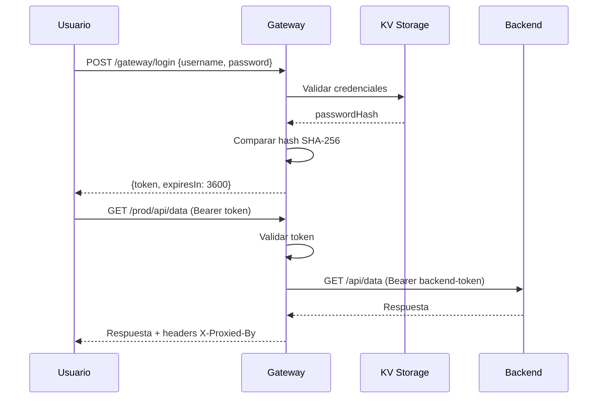

# 📋 Resumen del Sistema de Gateway

Este sistema consta de **3 componentes** que trabajan juntos para crear un gateway API con autenticación y enrutamiento dinámico.

---

## 🚪 **1. simple-gateway.ts** (Gateway Principal)

Actúa como **proxy inverso** que enruta peticiones a diferentes backends según su prefijo de ruta, con autenticación de usuarios.

### Variables de Entorno

| Variable | Default | Descripción |
|----------|---------|-------------|
| `PORT` | `8080` | Puerto donde escucha el gateway |
| `BACKENDS_REGISTRY_URL` | `https://kv-storage-api.deno.dev` | URL del KV storage donde están registrados backends y usuarios |
| `API_KEY` | `desarrollo-api-key-2026` | API Key para autenticarse con el KV storage |
| `TOKEN_TTL_MS` | `3600000` (1 hora) | Tiempo de vida de tokens de sesión de usuarios |
| `ENCRYPTION_KEY` | `go-oracle-api-secure-key-2026` | Clave para desencriptar tokens de backend |

### Funcionalidades Principales

- **Autenticación de Usuarios**: Valida credenciales contra KV storage y genera tokens Bearer
- **Gestión de Sesiones**: Maneja tokens con expiración automática y limpieza
- **Enrutamiento Dinámico**: Redirige peticiones a backends según prefijos registrados
- **Caché de Backends**: Carga backends desde KV storage al inicio y bajo demanda
- **Desencriptación de Tokens**: Desencripta tokens de backend con AES-GCM antes de hacer proxy
- **Auto-recarga**: Si no encuentra un backend, recarga la configuración automáticamente

### Endpoints Públicos (sin autenticación)

| Método | Ruta | Descripción |
|--------|------|-------------|
| `POST` | `/gateway/login` | Obtener token de autenticación. Body: `{username, password}` |
| `GET` | `/gateway/health` | Estado del gateway y número de backends |
| `POST` | `/gateway/reload` | Forzar recarga de backends desde KV storage |
| `OPTIONS` | `*` | Soporte CORS |

### Endpoints Protegidos (requieren token Bearer)

| Método | Ruta | Descripción |
|--------|------|-------------|
| `GET` | `/` o `/gateway` | Información del gateway, backends y endpoints |
| `GET` | `/gateway/backends` | Lista detallada de backends registrados |
| `GET` | `/gateway/users` | Lista de usuarios (sin contraseñas) |
| `POST` | `/gateway/logout` | Invalidar token actual |
| `*` | `/{prefix}/*` | Proxy a backend correspondiente según prefijo |

### Flujo de Autenticación



### Proceso de Proxy

1. **Validación**: Verifica token de usuario (excepto rutas públicas)
2. **Búsqueda**: Encuentra backend por prefijo más largo que coincida
3. **Transformación**: Remueve prefijo de la URL
4. **Desencriptación**: Desencripta token del backend (AES-GCM)
5. **Proxy**: Envía petición al backend con su token
6. **Respuesta**: Retorna respuesta con headers adicionales

---

## 🔧 **2. register-backend.ts** (Registro de Backends)

Script para **registrar backends** en el KV storage. Los backends son servicios que recibirán las peticiones proxy-eadas.

### Argumentos CLI

| Argumento | Requerido | Descripción |
|-----------|-----------|-------------|
| `--name` | ✅ | Identificador único del backend (ej: `produccion`, `desarrollo`) |
| `--backend-url` | ⚠️ | URL del backend (ej: `http://10.6.46.114:3013`) - requerido sin `--use-public-ip` |
| `--backend-token` | ✅ | Token Bearer que el backend espera recibir |
| `--prefix` | ✅ | Prefijo de ruta para enrutamiento (ej: `/prod`, `/desa`) |
| `--registry-url` | ✅ | URL del KV storage API |
| `--api-key` | ✅ | API Key del KV storage |
| `--use-public-ip` | ❌ | Usar IP pública en lugar de `--backend-url` |
| `--backend-port` | ⚠️ | Puerto local (requerido con `--use-public-ip`) |
| `--encryption-key` | ❌ | Clave para encriptar el token del backend |
| `--daemon` | ❌ | Ejecutar en modo continuo (re-registra cada 5 minutos) |

### Variables de Entorno Alternativas

```bash
BACKEND_NAME          # --name
BACKEND_URL           # --backend-url
BACKEND_TOKEN         # --backend-token
BACKEND_PREFIX        # --prefix
BACKENDS_REGISTRY_URL # --registry-url
API_KEY               # --api-key
PORT                  # --backend-port
ENCRYPTION_KEY        # --encryption-key
```

### ¿Qué hace?

1. **Valida configuración**: Verifica que todos los parámetros requeridos estén presentes
2. **Detecta IP pública**: Si `--use-public-ip`, obtiene IP de https://api.ipify.org
3. **Encripta el token**: Usa AES-GCM-256 + PBKDF2 (100,000 iteraciones)
4. **Registra/Actualiza**: 
   - GET primero para verificar si existe
   - PUT si existe (actualización)
   - POST si no existe (creación)
5. **Guarda metadata**: Timestamp, hostname, SO, arquitectura, versión Deno, IP pública
6. **Modo Daemon**: Re-registra cada 5 minutos (útil para IPs dinámicas o health checks)

### Formato de Datos Guardados

```json
{
  "key": "produccion",
  "data": {
    "name": "produccion",
    "url": "http://10.6.46.114:3013",
    "token": "base64-encrypted-token...",
    "prefix": "/prod"
  },
  "metadata": {
    "registeredAt": "2026-01-13T10:30:00.000Z",
    "lastUpdate": "2026-01-13T10:30:00.000Z",
    "system": {
      "hostname": "servidor-prod",
      "os": "linux",
      "arch": "x86_64",
      "denoVersion": "1.40.0",
      "publicIP": "203.0.113.45"
    }
  }
}
```

### Ejemplo de Uso

```bash
# Registro simple
deno run -A src/register-backend.ts \
  --name=produccion \
  --backend-url=http://api.prod.local:3000 \
  --backend-token=secret-prod-token-xyz \
  --prefix=/prod \
  --registry-url=https://kv-storage-api.deno.dev \
  --api-key=desarrollo-api-key-2026

# Con IP pública y modo daemon
deno run -A src/register-backend.ts \
  --name=desarrollo \
  --use-public-ip \
  --backend-port=3000 \
  --backend-token=dev-token-123 \
  --prefix=/desa \
  --registry-url=https://kv-storage-api.deno.dev \
  --api-key=desarrollo-api-key-2026 \
  --daemon
```

---

## 👤 **3. register-user.ts** (Gestión de Usuarios)

Script para **registrar, listar y eliminar usuarios** que podrán autenticarse en el gateway.

### Argumentos CLI

| Argumento (Alias) | Descripción |
|-------------------|-------------|
| `-u, --username` | Nombre de usuario (solo letras, números, guiones y guiones bajos) |
| `-p, --password` | Contraseña (mínimo 6 caracteres) |
| `-r, --roles` | Roles separados por coma (default: `user`) |
| `--registry-url` | URL del KV storage API |
| `--api-key` | API Key del KV storage |
| `-l, --list` | Listar todos los usuarios existentes |
| `-d, --delete` | Eliminar usuario por nombre |
| `-h, --help` | Mostrar ayuda |

### Variables de Entorno

```bash
BACKENDS_REGISTRY_URL  # URL del registry
API_KEY                # API Key
```

### ¿Qué hace?

#### **Registrar Usuario**
1. **Valida formato**: Username alfanumérico, password mínimo 6 caracteres
2. **Hashea password**: SHA-256 del password
3. **Guarda en KV storage**: Colección `users` con key = username
4. **Incluye metadata**: Roles y timestamp de creación

#### **Listar Usuarios**
- Obtiene todos los usuarios de la colección `users`
- Muestra: username, roles, fecha de creación

#### **Eliminar Usuario**
- DELETE del usuario especificado

### Formato de Datos de Usuario

```json
{
  "username": "admin",
  "passwordHash": "base64-sha256-hash...",
  "roles": ["admin", "user"],
  "createdAt": "2026-01-13T10:15:00.000Z"
}
```

### Ejemplos de Uso

```bash
# Registrar usuario básico
deno run -A src/register-user.ts \
  --username john \
  --password secret123

# Registrar admin
deno run -A src/register-user.ts \
  --username admin \
  --password admin123 \
  --roles admin,user

# Listar usuarios
deno run -A src/register-user.ts --list

# Eliminar usuario
deno run -A src/register-user.ts --delete john

# Con URL personalizada
deno run -A src/register-user.ts \
  --username maria \
  --password pass456 \
  --registry-url https://mi-api.com \
  --api-key mi-api-key
```

### Validaciones

- **Username**: `^[a-zA-Z0-9_-]+$` (solo alfanuméricos, guiones y guiones bajos)
- **Password**: Mínimo 6 caracteres
- **Roles**: String separado por comas, se divide en array

---

## 🔄 **Flujo de Trabajo Completo**

### 1️⃣ Preparación del Sistema

```bash
# A) Registrar Backend de Producción
deno run -A src/register-backend.ts \
  --name=produccion \
  --backend-url=http://api.prod.local:3000 \
  --backend-token=secret-prod-token \
  --prefix=/prod \
  --registry-url=https://kv-storage-api.deno.dev \
  --api-key=desarrollo-api-key-2026

# B) Registrar Backend de Desarrollo
deno run -A src/register-backend.ts \
  --name=desarrollo \
  --backend-url=http://localhost:3001 \
  --backend-token=dev-token-123 \
  --prefix=/desa \
  --registry-url=https://kv-storage-api.deno.dev \
  --api-key=desarrollo-api-key-2026

# C) Registrar Usuarios
deno run -A src/register-user.ts \
  --username admin \
  --password admin123 \
  --roles admin,user

deno run -A src/register-user.ts \
  --username developer \
  --password dev456 \
  --roles user
```

### 2️⃣ Iniciar Gateway

```bash
# Desarrollo local
deno run -A src/simple-gateway.ts

# Con variables de entorno personalizadas
PORT=8000 \
BACKENDS_REGISTRY_URL=https://kv-storage-api.deno.dev \
API_KEY=desarrollo-api-key-2026 \
TOKEN_TTL_MS=7200000 \
deno run -A src/simple-gateway.ts
```

### 3️⃣ Uso por Cliente

```bash
# 1. Login
curl -X POST http://localhost:8080/gateway/login \
  -H "Content-Type: application/json" \
  -d '{"username":"admin","password":"admin123"}'

# Respuesta:
# {
#   "token": "abc123xyz...",
#   "expiresIn": 3600,
#   "tokenType": "Bearer"
# }

# 2. Consultar información del gateway
curl http://localhost:8080/gateway \
  -H "Authorization: Bearer abc123xyz..."

# 3. Hacer petición a backend de producción
curl http://localhost:8080/prod/api/usuarios \
  -H "Authorization: Bearer abc123xyz..."
# Gateway proxy a: http://api.prod.local:3000/api/usuarios
# Con header: Authorization: Bearer secret-prod-token

# 4. Hacer petición a backend de desarrollo
curl http://localhost:8080/desa/api/test \
  -H "Authorization: Bearer abc123xyz..."
# Gateway proxy a: http://localhost:3001/api/test
# Con header: Authorization: Bearer dev-token-123

# 5. Logout
curl -X POST http://localhost:8080/gateway/logout \
  -H "Authorization: Bearer abc123xyz..."
```

---

## 🔑 **Características de Seguridad**

### Encriptación de Tokens de Backend

**Algoritmo**: AES-GCM-256 con PBKDF2

```typescript
// Proceso de Encriptación (register-backend.ts)
1. Generar salt aleatorio (16 bytes)
2. Derivar clave con PBKDF2:
   - Salt: 16 bytes aleatorios
   - Iteraciones: 100,000
   - Hash: SHA-256
   - Longitud: 256 bits
3. Generar IV aleatorio (12 bytes)
4. Encriptar con AES-GCM
5. Concatenar: salt + iv + datos encriptados
6. Codificar en Base64

// Proceso de Desencriptación (simple-gateway.ts)
1. Decodificar de Base64
2. Extraer salt (16 bytes), iv (12 bytes) y datos
3. Derivar clave con mismo PBKDF2
4. Desencriptar con AES-GCM
5. Usar token desencriptado en petición a backend
```

### Hash de Passwords

**Algoritmo**: SHA-256

```typescript
// register-user.ts y simple-gateway.ts
1. Codificar password en UTF-8
2. Aplicar SHA-256
3. Codificar resultado en Base64
4. Guardar en KV storage

// Validación en login
1. Usuario envía password en texto plano
2. Gateway hashea con SHA-256
3. Compara con hash guardado
4. Si coincide, genera token de sesión
```

### Tokens de Sesión

**Características**:
- Generados con `crypto.getRandomValues()` (32 bytes)
- Codificados en Base64 (sin +, /, =)
- Almacenados en memoria del gateway
- TTL configurable (default: 1 hora)
- Limpieza automática de tokens expirados

### Validación de Tokens

```typescript
// Headers requeridos para endpoints protegidos
Authorization: Bearer <token>

// Validación
1. Extraer token del header
2. Buscar en Map de tokens activos
3. Verificar expiración
4. Si expiró, eliminar y rechazar
5. Si válido, permitir acceso
```

---

## 📊 **Diagrama de Arquitectura**

```
┌─────────────────────────────────────────────────────────────────┐
│                         Cliente / Usuario                        │
└──────────────────────────────┬──────────────────────────────────┘
                               │
                    1. POST /gateway/login
                    2. Bearer token en requests
                               │
                               ▼
┌─────────────────────────────────────────────────────────────────┐
│                      Simple Gateway (8080)                       │
│  ┌──────────────────────────────────────────────────────────┐  │
│  │ • Valida token de usuario                                │  │
│  │ • Encuentra backend por prefijo                          │  │
│  │ • Desencripta token de backend                           │  │
│  │ • Proxy request con token desencriptado                  │  │
│  └──────────────────────────────────────────────────────────┘  │
└───────┬────────────────────────────────────┬────────────────────┘
        │                                    │
        │                                    │
        ▼                                    ▼
┌─────────────────┐              ┌──────────────────────┐
│  KV Storage API │              │   Backend Services   │
│                 │              │                      │
│ • users/        │              │ • /prod → api:3000  │
│ • backend/      │              │ • /desa → api:3001  │
│                 │              │                      │
│ Collections:    │              │ Autenticación:       │
│  ├─ users       │              │   Bearer backend-    │
│  └─ backend     │              │   token (decrypt)    │
└─────────────────┘              └──────────────────────┘
        ▲                                    ▲
        │                                    │
        │ 3. Registro                        │ 4. Health checks
        │    periódico                       │    (opcional daemon)
        │                                    │
┌───────┴────────────────────────────────────┴────────────────────┐
│                  Scripts de Administración                       │
│  ┌────────────────────────┐   ┌──────────────────────────┐     │
│  │  register-backend.ts   │   │   register-user.ts       │     │
│  │  • Encripta tokens     │   │   • Hashea passwords     │     │
│  │  • Registra backends   │   │   • Gestiona usuarios    │     │
│  │  • Modo daemon         │   │   • CRUD operaciones     │     │
│  └────────────────────────┘   └──────────────────────────┘     │
└─────────────────────────────────────────────────────────────────┘
```

---

## 🚀 **Casos de Uso**

### Caso 1: Múltiples Ambientes

```bash
# Backend Producción
register-backend --name=prod --prefix=/prod --backend-url=...

# Backend Staging
register-backend --name=staging --prefix=/staging --backend-url=...

# Backend Desarrollo
register-backend --name=dev --prefix=/dev --backend-url=...

# Cliente accede:
# - https://gateway.com/prod/api/users    → Backend Producción
# - https://gateway.com/staging/api/users → Backend Staging
# - https://gateway.com/dev/api/users     → Backend Desarrollo
```

### Caso 2: IPs Dinámicas

```bash
# Backend con IP dinámica (modo daemon)
register-backend \
  --name=home-server \
  --use-public-ip \
  --backend-port=3000 \
  --prefix=/home \
  --daemon  # Re-registra cada 5 minutos con nueva IP
```

### Caso 3: Microservicios

```bash
# Servicio de Usuarios
register-backend --name=users-svc --prefix=/api/users --backend-url=...

# Servicio de Productos
register-backend --name=products-svc --prefix=/api/products --backend-url=...

# Servicio de Pedidos
register-backend --name=orders-svc --prefix=/api/orders --backend-url=...

# Gateway enruta automáticamente según prefijo
```

---

## 🛠️ **Troubleshooting**

### Problema: "No backend found"

```bash
# Verificar backends registrados
curl http://localhost:8080/gateway/backends \
  -H "Authorization: Bearer <token>"

# Forzar recarga
curl -X POST http://localhost:8080/gateway/reload
```

### Problema: "Unauthorized" en backend

```bash
# El token puede estar mal encriptado/desencriptado
# Verificar que ENCRYPTION_KEY sea la misma en:
# - register-backend.ts (encriptación)
# - simple-gateway.ts (desencriptación)
```

### Problema: "Invalid credentials" en login

```bash
# Listar usuarios
deno run -A src/register-user.ts --list

# Verificar que el usuario existe y password es correcta
# El hash debe coincidir exactamente
```

---

## 📝 **Notas Importantes**

1. **Tokens de Backend**: Se encriptan con AES-GCM antes de guardar en KV storage por seguridad
2. **Passwords de Usuario**: Se hashean con SHA-256 (considerar bcrypt para producción)
3. **CORS**: Habilitado por defecto (`Access-Control-Allow-Origin: *`)
4. **Prefijos**: El matching usa el prefijo más largo que coincida
5. **Recarga Automática**: Si no encuentra un backend, recarga automáticamente antes de fallar
6. **Metadata**: Los backends guardan información del sistema para debugging
7. **Modo Daemon**: Útil para mantener backends actualizados o con IPs dinámicas

---

## 💡 **Recomendaciones y Mejoras**

### 🔒 **Seguridad**

#### 1. **Mejora de Hash de Passwords** ⚠️ CRÍTICO
**Problema Actual**: SHA-256 es rápido y vulnerable a ataques de fuerza bruta
```typescript
// ❌ Actual (SHA-256 simple)
const hash = await crypto.subtle.digest('SHA-256', data);

// ✅ Recomendado (usar biblioteca bcrypt o scrypt)
import * as bcrypt from "https://deno.land/x/bcrypt/mod.ts";
const hash = await bcrypt.hash(password, 12); // 12 rounds
const isValid = await bcrypt.compare(password, hash);
```

#### 2. **Rate Limiting en Login** ⚠️ IMPORTANTE
Proteger contra ataques de fuerza bruta:
```typescript
class RateLimiter {
    private attempts = new Map<string, { count: number; resetAt: number }>();
    
    check(ip: string, maxAttempts = 5, windowMs = 15 * 60 * 1000): boolean {
        const now = Date.now();
        const record = this.attempts.get(ip);
        
        if (!record || now > record.resetAt) {
            this.attempts.set(ip, { count: 1, resetAt: now + windowMs });
            return true;
        }
        
        if (record.count >= maxAttempts) return false;
        
        record.count++;
        return true;
    }
}
```

#### 3. **CORS Configurable** ⚠️ IMPORTANTE
```typescript
// ❌ Actual (inseguro en producción)
'Access-Control-Allow-Origin': '*'

// ✅ Recomendado
const ALLOWED_ORIGINS = Deno.env.get('ALLOWED_ORIGINS')?.split(',') || ['*'];
const origin = req.headers.get('Origin');
const allowedOrigin = ALLOWED_ORIGINS.includes('*') ? '*' : 
    (ALLOWED_ORIGINS.includes(origin) ? origin : ALLOWED_ORIGINS[0]);
```

#### 4. **Refresh Tokens**
Implementar refresh tokens para no exponer constantemente credenciales:
```typescript
interface TokenPair {
    accessToken: string;    // TTL corto (15 min)
    refreshToken: string;   // TTL largo (7 días)
    expiresIn: number;
}

// Endpoint: POST /gateway/refresh
// Body: { refreshToken: "..." }
// Returns: nueva pareja de tokens
```

#### 5. **Rotación de Claves**
- Versionado de `ENCRYPTION_KEY` para permitir rotación sin downtime
- Almacenar múltiples versiones: `ENCRYPTION_KEY_V1`, `ENCRYPTION_KEY_V2`
- Intentar desencriptar con ambas versiones

#### 6. **Headers de Seguridad**
Agregar headers estándar de seguridad:
```typescript
headers.set('X-Content-Type-Options', 'nosniff');
headers.set('X-Frame-Options', 'DENY');
headers.set('X-XSS-Protection', '1; mode=block');
headers.set('Strict-Transport-Security', 'max-age=31536000; includeSubDomains');
```

---

### 📊 **Monitoreo y Observabilidad**

#### 7. **Métricas Estructuradas**
```typescript
interface Metrics {
    requests: { total: number; byBackend: Map<string, number>; errors: number };
    latency: { avg: number; p95: number; p99: number };
    auth: { logins: number; failures: number; activeTokens: number };
    backends: { total: number; healthy: number; unhealthy: number };
}

// Endpoint: GET /gateway/metrics (protegido, rol admin)
```

#### 8. **Logging Estructurado**
```typescript
// ❌ Actual
console.log(`➡️  ${req.method} ${url.pathname} -> ${backend.name}`);

// ✅ Recomendado (JSON structured logging)
logger.info({
    event: 'proxy_request',
    method: req.method,
    path: url.pathname,
    backend: backend.name,
    backendUrl: backendUrl,
    latency: endTime - startTime,
    status: response.status,
    timestamp: new Date().toISOString(),
    requestId: crypto.randomUUID() // Agregar request ID
});
```

#### 9. **Health Checks Reales de Backends**
```typescript
// Verificar salud real de backends periódicamente
async checkBackendHealth(backend: Backend): Promise<boolean> {
    try {
        const response = await fetch(`${backend.url}/health`, {
            signal: AbortSignal.timeout(3000)
        });
        return response.ok;
    } catch {
        return false;
    }
}

// Ejecutar cada 30 segundos y marcar backends como healthy/unhealthy
```

#### 10. **Tracing Distribuido**
Agregar headers para correlación de requests:
```typescript
const requestId = crypto.randomUUID();
const traceId = req.headers.get('X-Trace-ID') || crypto.randomUUID();

headers.set('X-Request-ID', requestId);
headers.set('X-Trace-ID', traceId);
```

---

### 🚀 **Rendimiento**

#### 11. **Caché de Backends con TTL**
```typescript
// ❌ Actual: solo recarga bajo demanda
// ✅ Recomendado: TTL configurable

private backendsCache = {
    data: new Map<string, Backend>(),
    lastLoad: 0,
    ttl: parseInt(Deno.env.get('BACKENDS_CACHE_TTL_MS') || '30000')
};

async getBackends(): Promise<Map<string, Backend>> {
    const now = Date.now();
    if (now - this.backendsCache.lastLoad > this.backendsCache.ttl) {
        await this.loadBackends();
    }
    return this.backendsCache.data;
}
```

#### 12. **Connection Pooling**
Considerar reutilizar conexiones HTTP para backends:
```typescript
// Deno.createHttpClient con keepAlive
const httpClient = Deno.createHttpClient({
    poolMaxIdlePerHost: 10,
    poolIdleTimeout: 90_000,
});
```

#### 13. **Compresión de Responses**
```typescript
// Verificar Accept-Encoding y comprimir si es posible
if (req.headers.get('Accept-Encoding')?.includes('gzip')) {
    // Aplicar compresión gzip
}
```

---

### 🛠️ **Mantenibilidad**

#### 14. **Validación de Configuración al Inicio**
```typescript
function validateConfig() {
    const required = {
        BACKENDS_REGISTRY_URL,
        API_KEY,
        ENCRYPTION_KEY
    };
    
    for (const [key, value] of Object.entries(required)) {
        if (!value) {
            console.error(`❌ Variable requerida no configurada: ${key}`);
            Deno.exit(1);
        }
    }
    
    if (ENCRYPTION_KEY.length < 32) {
        console.warn('⚠️  ENCRYPTION_KEY muy corta, usar al menos 32 caracteres');
    }
}
```

#### 15. **Modularización del Código**
Separar en módulos:
```
src/
  ├── gateway.ts          # Clase principal
  ├── auth/
  │   ├── token.ts        # Gestión de tokens
  │   ├── password.ts     # Hash de passwords
  │   └── rate-limit.ts   # Rate limiting
  ├── proxy/
  │   ├── router.ts       # Enrutamiento
  │   └── backend.ts      # Gestión de backends
  ├── middleware/
  │   ├── cors.ts
  │   ├── logging.ts
  │   └── security.ts
  └── utils/
      ├── crypto.ts       # Encriptación
      └── metrics.ts      # Métricas
```

#### 16. **Tipos TypeScript más Estrictos**
```typescript
// Usar tipos más específicos
type Role = 'admin' | 'user' | 'readonly';
type HTTPMethod = 'GET' | 'POST' | 'PUT' | 'DELETE' | 'PATCH';

interface User {
    username: string;
    passwordHash: string;
    roles: Role[];
    createdAt: Date;
    lastLogin?: Date;
    isActive: boolean;
}
```

#### 17. **Testing**
Agregar pruebas:
```typescript
// tests/
//   ├── auth.test.ts
//   ├── routing.test.ts
//   ├── encryption.test.ts
//   └── integration.test.ts

// Ejemplo con Deno testing
Deno.test("login con credenciales válidas", async () => {
    const response = await fetch('http://localhost:8080/gateway/login', {
        method: 'POST',
        body: JSON.stringify({ username: 'test', password: 'test123' })
    });
    assertEquals(response.status, 200);
    const data = await response.json();
    assert(data.token);
});
```

---

### 📝 **Funcionalidades Adicionales**

#### 18. **Roles y Permisos Granulares**
```typescript
interface Permission {
    resource: string;      // ej: '/prod/*', '/desa/api/users'
    actions: HTTPMethod[]; // ['GET', 'POST']
    roles: Role[];         // ['admin', 'user']
}

// Validar permisos antes de proxy
function checkPermission(user: User, resource: string, method: HTTPMethod): boolean {
    // Lógica de autorización
}
```

#### 19. **Webhook de Eventos**
Notificar eventos importantes:
```typescript
enum EventType {
    BACKEND_REGISTERED = 'backend.registered',
    BACKEND_UNHEALTHY = 'backend.unhealthy',
    LOGIN_FAILED = 'auth.login_failed',
    RATE_LIMIT_HIT = 'security.rate_limit_hit'
}

async notifyWebhook(event: EventType, data: any) {
    if (WEBHOOK_URL) {
        await fetch(WEBHOOK_URL, {
            method: 'POST',
            body: JSON.stringify({ event, data, timestamp: Date.now() })
        });
    }
}
```

#### 20. **Circuit Breaker**
Proteger contra backends caídos:
```typescript
class CircuitBreaker {
    private failures = 0;
    private state: 'closed' | 'open' | 'half-open' = 'closed';
    private nextRetry = 0;
    
    async call<T>(fn: () => Promise<T>): Promise<T> {
        if (this.state === 'open') {
            if (Date.now() < this.nextRetry) {
                throw new Error('Circuit breaker is OPEN');
            }
            this.state = 'half-open';
        }
        
        try {
            const result = await fn();
            this.onSuccess();
            return result;
        } catch (error) {
            this.onFailure();
            throw error;
        }
    }
}
```

#### 21. **API Documentation (OpenAPI/Swagger)**
```yaml
# openapi.yaml
openapi: 3.0.0
info:
  title: Simple Gateway API
  version: 1.0.0
paths:
  /gateway/login:
    post:
      summary: Autenticar usuario
      requestBody:
        required: true
        content:
          application/json:
            schema:
              type: object
              properties:
                username: {type: string}
                password: {type: string}
```

#### 22. **Request/Response Transformation**
Permitir modificar requests/responses en el gateway:
```typescript
interface Transform {
    type: 'request' | 'response';
    backend: string;
    transform: (data: any) => any;
}

// Ejemplo: Agregar campos, renombrar propiedades, filtrar data sensible
```

#### 23. **Caché de Responses**
Para endpoints idempotentes:
```typescript
class ResponseCache {
    private cache = new Map<string, { data: Response; expiresAt: number }>();
    
    get(key: string): Response | null {
        const cached = this.cache.get(key);
        if (cached && Date.now() < cached.expiresAt) {
            return cached.data.clone();
        }
        return null;
    }
}
```

#### 24. **WebSocket Support**
Permitir proxy de conexiones WebSocket:
```typescript
if (req.headers.get('upgrade') === 'websocket') {
    // Manejar upgrade a WebSocket
    const { socket, response } = Deno.upgradeWebSocket(req);
    // Establecer proxy bidireccional
}
```

#### 25. **Variables de Entorno por Archivo**
```typescript
// .env support
import { load } from "https://deno.land/std@0.210.0/dotenv/mod.ts";
const env = await load();
```

---

### 🔧 **DevOps y Deployment**

#### 26. **Docker/Containerización**
```dockerfile
FROM denoland/deno:alpine
WORKDIR /app
COPY . .
RUN deno cache src/simple-gateway.ts
EXPOSE 8080
CMD ["deno", "run", "-A", "src/simple-gateway.ts"]
```

#### 27. **Graceful Shutdown**
```typescript
// Manejar SIGTERM/SIGINT correctamente
Deno.addSignalListener("SIGINT", async () => {
    console.log("\n🛑 Shutting down gracefully...");
    // Esperar requests en curso
    await server.shutdown();
    // Cerrar conexiones
    Deno.exit(0);
});
```

#### 28. **Configuración de Producción**
Crear perfiles de configuración:
```typescript
// config/production.ts
export default {
    cors: { origins: ['https://myapp.com'] },
    rateLimit: { maxAttempts: 3, windowMs: 15 * 60 * 1000 },
    logging: { level: 'warn', format: 'json' },
    backends: { healthCheckInterval: 30000 },
};
```

---

### 📊 **Prioridades Recomendadas**

| Prioridad | Mejora | Impacto | Esfuerzo |
|-----------|--------|---------|----------|
| 🔴 **ALTA** | Bcrypt para passwords (#1) | Seguridad crítica | Bajo |
| 🔴 **ALTA** | Rate limiting (#2) | Seguridad crítica | Medio |
| 🟡 **MEDIA** | CORS configurable (#3) | Seguridad | Bajo |
| 🟡 **MEDIA** | Logging estructurado (#8) | Observabilidad | Bajo |
| 🟡 **MEDIA** | Health checks de backends (#9) | Confiabilidad | Medio |
| 🟡 **MEDIA** | Validación de config (#14) | Mantenibilidad | Bajo |
| 🟢 **BAJA** | Refresh tokens (#4) | UX | Alto |
| 🟢 **BAJA** | Circuit breaker (#20) | Confiabilidad | Alto |
| 🟢 **BAJA** | Métricas (#7) | Observabilidad | Medio |

---

**Fecha de Documentación**: 13 de enero de 2026
