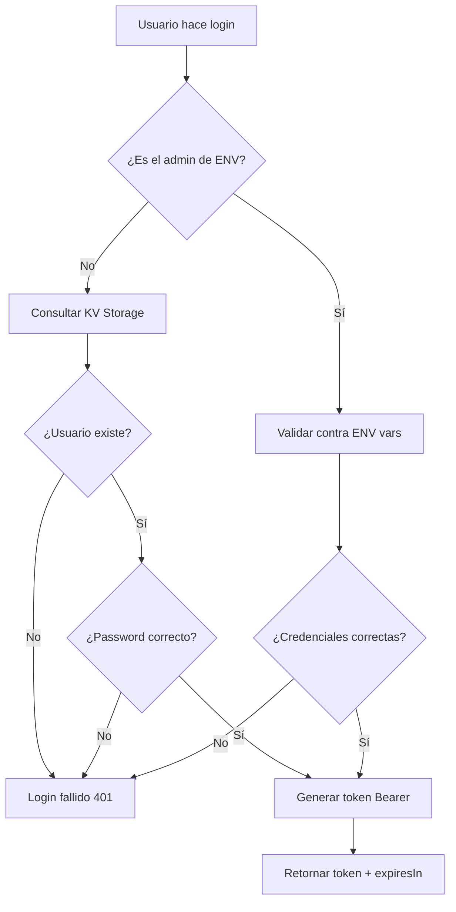

# 👥 Gestión de Usuarios

El gateway ahora soporta autenticación con usuarios almacenados en **KV Storage**.

## 📋 Características

- ✅ Registro de usuarios en KV Storage
- ✅ Passwords hasheados con SHA-256
- ✅ Roles por usuario (user, admin, etc.)
- ✅ Login con validación contra KV
- ✅ Fallback al usuario admin de variables de entorno

---

## 🚀 Registrar Usuarios

### Registrar usuario básico

```bash
deno task register:user --username juan --password secret123
```

### Registrar admin con múltiples roles

```bash
deno task register:user --username maria --password admin456 --roles admin,user
```

### Con variables de entorno personalizadas

```bash
$env:BACKENDS_REGISTRY_URL="https://kv-storage-api.deno.dev"
$env:API_KEY="tu-api-key"

deno task register:user --username pedro --password pass789
```

---

## 📝 Listar Usuarios

```bash
deno task register:user --list
```

**Salida:**
```
📋 Listando usuarios registrados...
📍 Registry: https://kv-storage-api.deno.dev

✅ 3 usuario(s) encontrado(s):

👤 juan
   Roles: user
   Creado: 2026-01-08T10:30:00.000Z

👤 maria
   Roles: admin, user
   Creado: 2026-01-08T10:31:00.000Z

👤 pedro
   Roles: user
   Creado: 2026-01-08T10:32:00.000Z
```

---

## 🗑️ Eliminar Usuarios

```bash
deno task register:user --delete juan
```

---

## 🔐 Login con Usuarios Registrados

Los usuarios registrados pueden hacer login en el gateway:

### 1. Login con usuario de KV Storage

```bash
curl -X POST http://localhost:8000/gateway/login \
  -H "Content-Type: application/json" \
  -d '{"username":"maria","password":"admin456"}'
```

**Respuesta:**
```json
{
  "token": "ABC123XYZ...",
  "expiresIn": 3600,
  "tokenType": "Bearer"
}
```

### 2. Login con usuario admin (fallback)

El usuario admin de las variables de entorno sigue funcionando:

```bash
curl -X POST http://localhost:8000/gateway/login \
  -H "Content-Type: application/json" \
  -d '{"username":"admin","password":"admin123"}'
```

---

## 🔄 Flujo de Autenticación


```mermaid
graph TD
    A[Usuario hace login] --> B{¿Es el admin de ENV?}
    B -->|Sí| C[Validar contra ENV vars]
    B -->|No| D[Consultar KV Storage]
    D --> E{¿Usuario existe?}
    E -->|Sí| F{¿Password correcto?}
    E -->|No| G[Login fallido 401]
    F -->|Sí| H[Generar token Bearer]
    F -->|No| G
    C --> I{¿Credenciales correctas?}
    I -->|Sí| H
    I -->|No| G
    H --> J[Retornar token + expiresIn]
```

**Prioridad de validación:**
1. **Primero**: Verifica si es el usuario admin de las variables de entorno
2. **Segundo**: Si no es admin, busca en KV Storage
3. **Resultado**: Si alguno de los dos es válido, genera token

---

## 🔒 Seguridad

### Password Hashing

Los passwords se hashean con **SHA-256** antes de almacenarse:

```typescript
// En register-user.ts
async function hashPassword(password: string): Promise<string> {
    const encoder = new TextEncoder();
    const data = encoder.encode(password);
    const hashBuffer = await crypto.subtle.digest('SHA-256', data);
    return btoa(String.fromCharCode(...new Uint8Array(hashBuffer)));
}
```

### Validación en Gateway

El gateway valida el password hasheando el input y comparándolo:

```typescript
// En gateway-server.ts
private async validateUserFromKV(username: string, password: string): Promise<boolean> {
    const response = await fetch(`${CONFIG.backendsRegistryUrl}/collections/users/${username}`);
    const data = await response.json();
    const passwordHash = await this.hashPassword(password);
    return data.data.passwordHash === passwordHash;
}
```

### Recomendaciones

- ✅ Usa passwords de al menos 6 caracteres
- ✅ Los passwords nunca se almacenan en texto plano
- ✅ Los tokens tienen tiempo de expiración configurable
- ✅ Usa HTTPS en producción
- ✅ Implementa logout al terminar la sesión

---

## 📊 Estructura en KV Storage

### Colección: `users`

Cada usuario se almacena con esta estructura:

```json
{
  "key": "username",
  "data": {
    "username": "maria",
    "passwordHash": "OiJIUzI1NiIsInR5cCI6IkpXVCJ9...",
    "roles": ["admin", "user"],
    "createdAt": "2026-01-08T10:30:00.000Z"
  }
}
```

**Campos:**
- `username`: Nombre de usuario único
- `passwordHash`: Hash SHA-256 del password en Base64
- `roles`: Array de roles asignados
- `createdAt`: Timestamp de creación

---

## ⚙️ Configuración

### Variables de Entorno

```bash
# KV Storage (requerido para usuarios en KV)
$env:BACKENDS_REGISTRY_URL="https://kv-storage-api.deno.dev"
$env:API_KEY="tu-api-key"

# Usuario admin fallback (opcional)
$env:GATEWAY_USERNAME="admin"
$env:GATEWAY_PASSWORD="admin123"

# Configuración de tokens
$env:TOKEN_TTL_MS="3600000"  # 1 hora en milisegundos
```

---

## 🧪 Testing

### Test manual del flujo completo

```powershell
# 1. Registrar usuario
deno task register:user --username test --password test123

# 2. Iniciar gateway
deno task dev

# 3. Login con usuario registrado (en otra terminal)
$response = Invoke-WebRequest -Method POST `
  -Uri "http://localhost:8000/gateway/login" `
  -ContentType "application/json" `
  -Body '{"username":"test","password":"test123"}' | ConvertFrom-Json

$token = $response.token
Write-Host "Token obtenido: $token"

# 4. Usar token para acceder a endpoints protegidos
Invoke-WebRequest -Uri "http://localhost:8000/gateway/status" `
  -Headers @{Authorization="Bearer $token"}

# 5. Logout
Invoke-WebRequest -Method POST `
  -Uri "http://localhost:8000/gateway/logout" `
  -Headers @{Authorization="Bearer $token"}
```

---

## ❓ FAQ

### ¿Puedo tener usuarios en KV y admin en ENV al mismo tiempo?

Sí, el gateway valida primero contra las variables de entorno y luego contra KV Storage. Ambos pueden coexistir.

### ¿Cómo cambio el password de un usuario?

Elimina el usuario y regístralo nuevamente:

```bash
deno task register:user --delete juan
deno task register:user --username juan --password nuevo-password
```

### ¿Los roles se validan automáticamente?

No, actualmente el gateway solo valida usuario/password. La validación de roles debe implementarse según tus necesidades específicas.

### ¿Qué pasa si KV Storage no está disponible?

El usuario admin de las variables de entorno seguirá funcionando como fallback.

### ¿Puedo usar un algoritmo de hash más fuerte?

Sí, puedes modificar `hashPassword()` en ambos archivos para usar bcrypt u otro algoritmo más robusto.

---

## 📚 Ver También

- [AUTHENTICATION.md](AUTHENTICATION.md) - Guía de autenticación con tokens Bearer
- [QUICKSTART.md](QUICKSTART.md) - Inicio rápido del gateway
- [TESTING.md](TESTING.md) - Guía de testing completa
